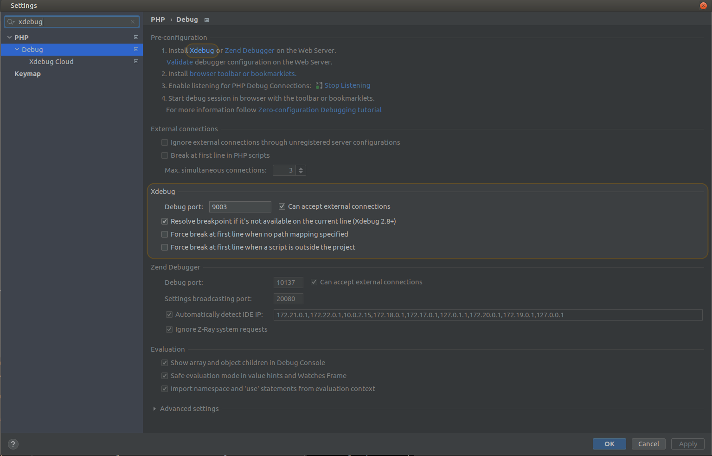
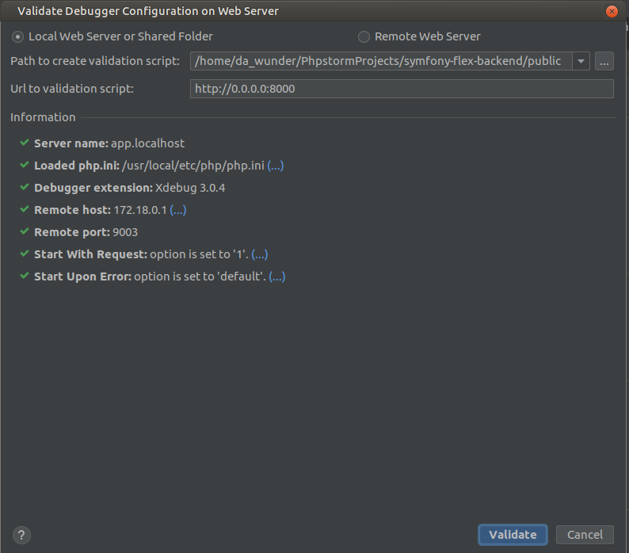
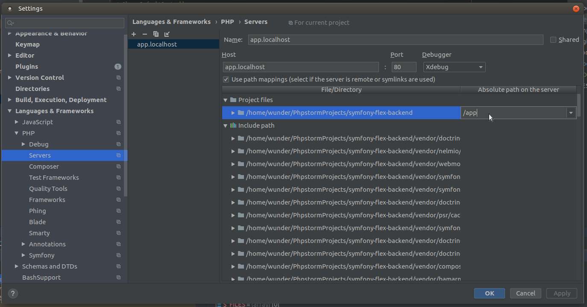
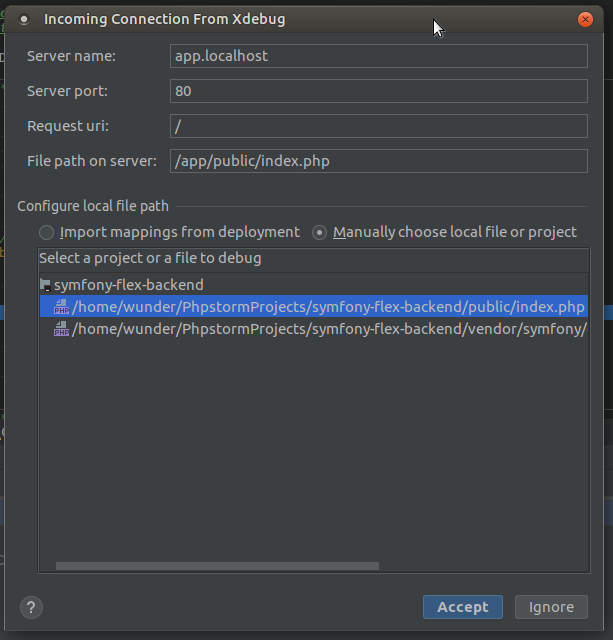

# What is this?

This document contains basic information how you can use [Xdebug](https://xdebug.org/)
and [PhpStorm](https://www.jetbrains.com/phpstorm/) within this application.

And before you start with this section off documentation you really should read
[PhpStorm configuration](PHPSTORM.md) documentation first - that way you will
have all basic configuration ready.

## Table of Contents

* [What is this?](#what-is-this)
  * [Table of Contents](#table-of-contents)
  * [Configuration and usage](#configuration-and-usage)
    * [PhpStorm basic configuration](#phpstorm-basic-configuration)
    * [First connection](#first-connection)
    * [Configuring debugging server](#configuring-debugging-server)
  * [Mac users](#mac-users)
  * [Debug CLI commands](#debug-cli-commands)
  * [Debug Postman requests](#debug-postman-requests)
  * [External links / resources](#external-links--resources)
  * [Closure](#closure)

## Configuration and usage

These instructions relies heavily to screenshots, so you might need to use
your own brains for some parts of these instructions - but I bet you can get
this working in couple of minutes.

Note that if you're using Mac, read [Mac users](#mac-users) section first.

### PhpStorm basic configuration

1) Make sure that Xdebug port is `9009`
2) Validate debugger configuration
3) Install needed browser extensions

You can check all those within screen as below:



Note that validation screen should look like image below:



Create Run/Debug Configuration like in image below:



### First connection

After you have make sure that all basic things are configured properly you can
start to listen incoming PHP debug connections. After this you need to do
following:

1) Add breakpoint to your code
2) Enable Xdebug in your browser
3) Reload browser page

After that you should see following:



And in this screen select the correct `index.php` file.

### Configuring debugging server

Last step is to configure used paths on debugging server to match with your
local paths. See the image below:


## Mac users

Mac users need to create a `docker-compose.override.yml` file with following
content:

```yaml
version: '3'
services:
  php:
    environment:
      - DOCKER_WITH_MAC=1
```

And if you're reading this you might want to read [Speed problems with docker-compose?](SPEED_UP_DOCKER_COMPOSE.md)
document, which will tell you how to speed your Mac environment quite lot.

You just need to combine those both configurations to your local
`docker-compose.override.yml` file

## Debug CLI commands

By default this application assumes that you're using `app.localhost` as your
PHP server that you've configured to your IDE. If you need to change that, just
override that in your local `docker-compose.override.yml` file.

See those [External links / resources](#external-links--resources) on this
documentation to get more information.

## Debug Postman requests

If you're using [Postman](https://www.getpostman.com/) to test / debug your
application you need to add `?XDEBUG_SESSION_START=PHPSTORM` to each URL
that you use with Postman.

## External links / resources

* [Debugging PHP (web and cli) with Xdebug using Docker and PHPStorm](https://thecodingmachine.io/configuring-xdebug-phpstorm-docker)
* [Debug your PHP in Docker with Intellij/PHPStorm and Xdebug](https://gist.github.com/jehaby/61a89b15571b4bceee2417106e80240d)
* [Debugging with Postman and PHPStorm (Xdebug)](https://www.thinkbean.com/drupal-development-blog/debugging-postman-and-phpstorm-xdebug)

## Closure

Happy debugging \o/ - it has not ever be as easy as this...

---

[Back to resources index](README.md) - [Back to main README.md](../README.md)
